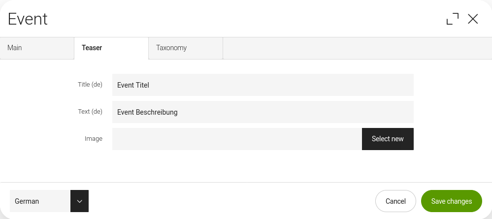

# ChildNodeWrapper
Allows to save fields in child nodes without being nested in a composite/switchable field. 


<br>


## Usage
### Dialog

```java
import info.magnolia.ui.field.EditorPropertyDefinition;
import info.magnolia.module.blossom.annotation.TabFactory;

import com.merkle.oss.magnolia.definition.custom.childnodewrapper.ChildNodeWrapper;

@TabFactory("someTab")
public List<EditorPropertyDefinition> someTab() {
    return ChildNodeWrapper.wrap("teaser",
            new TextFieldDefinitionBuilder().i18n().build("title"),
            new TextFieldDefinitionBuilder().i18n().build("text"),
            new AssetLinkDefinitionBuilder().build("image")
    );
}
```