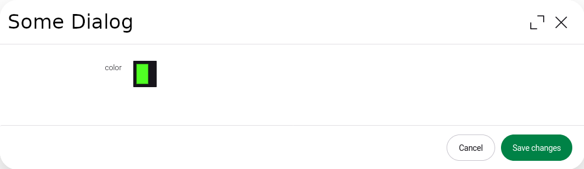
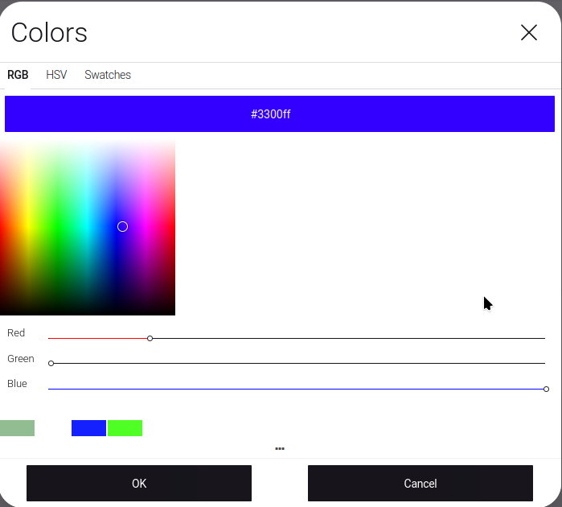
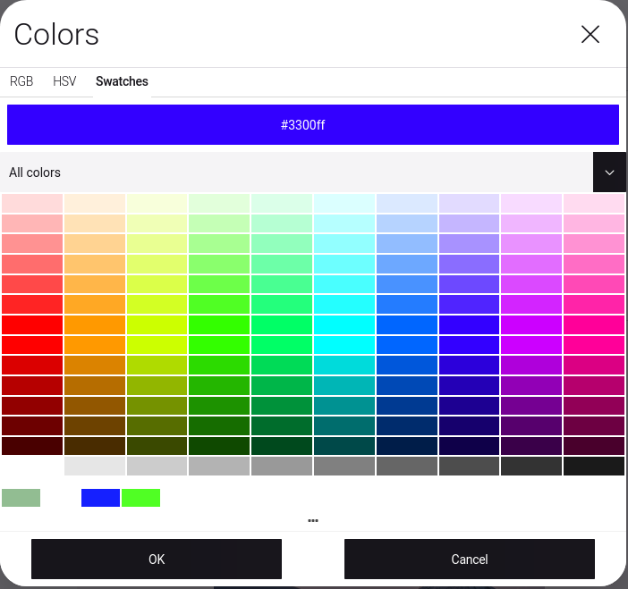

# Color-Picker
A color picker field using vaadin color picker.

## Screenshots
### Dialog


### Picker
| rgb                                              | swatches                                              | hsv                                              | 
|--------------------------------------------------|-------------------------------------------------------|--------------------------------------------------|
|  |  |  |


## Usage
### Dialog

```java
import info.magnolia.ui.field.EditorPropertyDefinition;
import info.magnolia.module.blossom.annotation.TabFactory;

import com.merkle.oss.magnolia.definition.custom.colorpicker.ColorPickerFieldDefinitionBuilder;

@TabFactory("someTab")
public List<EditorPropertyDefinition> someTab() {
    return List.of(
            new ColorPickerFieldDefinitionBuilder().history().hsvv().rgb().swatches().textField().build("color")
    );
}
```
### Model

```java
import info.magnolia.jcr.util.PropertyUtil;
import com.vaadin.shared.ui.colorpicker.Color;

private final ColorFactory colorFactory;

@RequestMapping("someComponentRequestMapping")
public String render(final Model model, final PowerNode node) {
    colorFactory.create("color", node);
    colorFactory.create("color", dialogLocale, node); // if color is i18n
    ...
}
```