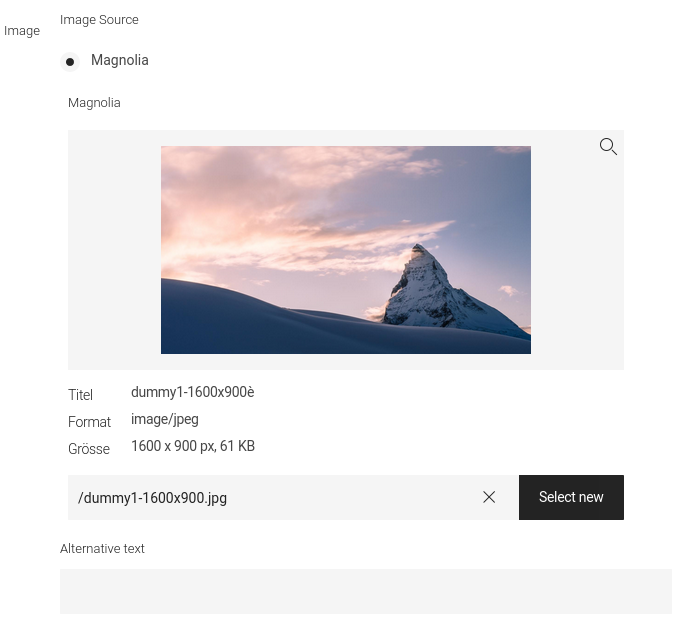
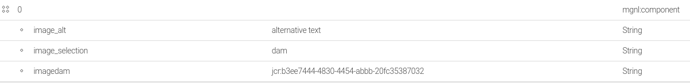

# ImageSet
A imageSet groups the fields image-source, alternative-text for different image types, from which the author can choose from.

## Usage
### Dialog
```java
import com.merkle.oss.magnolia.definition.custom.imageset.ImageTypes;
import info.magnolia.ui.field.EditorPropertyDefinition;
import info.magnolia.module.blossom.annotation.TabFactory;
import com.merkle.oss.magnolia.definition.custom.imageset.ImageSetDefinitionBuilder;

@TabFactory("someTab")
public List<EditorPropertyDefinition> someTab() {
	return List.of(
               new ImageSetDefinitionBuilder().build("image"),
               new ImageSetDefinitionBuilder().imageOptions(ImageTypes.DAM).build("imageOnlyMagnoliaAssets")
	);
}
```
### Model

```java
import com.merkle.oss.magnolia.definition.custom.imageset.model.ImageModel;
import com.merkle.oss.magnolia.definition.custom.imageset.model.ImageReferenceModel;

private final ImageReferenceModel.Factory imageReferenceFactory;
private final ImageModel.Factory imageFactory;

@RequestMapping("someComponentRequestMapping")
public String render(final Model model, final PowerNode node) {
   imageReferenceFactory.create("image", node);
   imageReferenceFactory.create("image", dialogLocale, node); // if image is i18n
   imageFactory.create(locale, "image", node);
   imageFactory.create(locale, dialogLocale, "image", node); // if image is i18n (locale can differ from dialogLocale)
}
```

## Predefined image-types
### DAM
Internal magnolia DAM asset.


<br>


## imageFieldI18n
1. Extend ImageSetDefinitionBuilder
   ```java
   import com.merkle.oss.magnolia.definition.custom.imageset.ImageSetDefinitionBuilder;
   
   public class CustomImageSetDefinitionBuilder extends ImageSetDefinitionBuilder {
      public CustomImageSetDefinitionBuilder() {
         super(false);
      }
   }
   ```
2. Extend ImageReferenceModel.Factory
   ```java
   import java.util.Set;
   import javax.inject.Inject;
   import com.merkle.oss.magnolia.definition.custom.configuration.LocaleProvider;
   import com.merkle.oss.magnolia.definition.custom.imageset.ImageType;
   import com.merkle.oss.magnolia.definition.custom.imageset.model.ImageReferenceModel;
   
   public class CustomImageReferenceModelFactory extends ImageReferenceModel.Factory {
      @Inject
      public CustomImageReferenceModelFactory(
              final Set<ImageType.Resolver> imageTypeResolvers,
              final LocaleProvider localeProvider
      ) {
         super(imageTypeResolvers, localeProvider, false);
      }
   }
   ```
3. Extend ImageModel.Factory
   ```java
   import java.util.Set;
   import javax.inject.Inject;
   import com.merkle.oss.magnolia.definition.custom.configuration.LocaleProvider;
   import com.merkle.oss.magnolia.definition.custom.imageset.model.ImageModel;
   
   public class CustomImageModelFactory extends ImageModel.Factory  {
       @Inject
       public CustomImageModelFactory(
               final LocaleProvider localeProvider,
               final CustomImageReferenceModelFactory imageReferenceFactory,
               final Set<ImageModel.ImageSourceTransformer> imageSourceTransformers
       ) {
           super(localeProvider, imageReferenceFactory, imageSourceTransformers);
       }
   }
   ```
4. Bind both factories
   ```xml
   <component>
      <type>com.merkle.oss.magnolia.definition.custom.imageset.model.ImageModel$Factory</type>
      <implementation>...CustomImageModelFactory</implementation>
   </component>
   <component>
      <type>com.merkle.oss.magnolia.definition.custom.imageset.model.ImageReferenceModel$Factory</type>
      <implementation>...CustomImageReferenceModelFactory</implementation>
   </component>
   ```

## Custom image-types
1. Define custom image types
    ```java
   import com.merkle.oss.magnolia.definition.custom.imageset.ImageType;
   
   import java.util.Arrays;
   import java.util.Objects;
   import java.util.Optional;
   
   public enum CustomImageTypes implements ImageType {
       APRIMO("imageType.aprimo.label", "aprimo");
   
       private final String label;
       private final String value;
   
       CustomImageTypes(final String label, final String value) {
           this.label = label;
           this.value = value;
       }
   
       @Override
       public String getLabel() {
           return label;
       }
   
       @Override
       public String getValue() {
           return value;
       }
   
       public static Optional<ImageType> fromValue(final String value) {
           return Arrays.stream(values())
                   .filter(type -> Objects.equals(type.getValue(), value))
                   .findFirst()
                   .map(imageType -> imageType);
       }
   }
    ```
2. Implement CustomLinkSetDefinitionBuilder
   ```java
   import com.merkle.oss.magnolia.definition.builder.simple.TextFieldDefinitionBuilder;
   import com.merkle.oss.magnolia.definition.custom.imageset.ImageSetDefinitionBuilder;
   import com.merkle.oss.magnolia.definition.custom.imageset.ImageType;
   import com.merkle.oss.magnolia.definition.custom.imageset.ImageTypes;
   import com.merkle.oss.magnolia.definition.custom.switchable.FieldOption;
   import com.merkle.oss.magnolia.definition.custom.switchable.SingleSwitchableForm;
   
   import java.util.Arrays;
   import java.util.stream.Collectors;
   import java.util.stream.Stream;
   
   public class CustomImageSetDefinitionBuilder extends ImageSetDefinitionBuilder {
   
      public CustomImageSetDefinitionBuilder() {
         //set default image-types to all
         imageOptions(Stream.concat(
                 Arrays.stream(ImageTypes.values()),
                 Arrays.stream(CustomImageTypes.values())
         ).collect(Collectors.toList()));
      }
   
      @Override
      protected FieldOption<ImageType> createFieldOption(final ImageType imageType) {
         if(CustomImageTypes.APRIMO.equals(imageType)) {
            return aprimo();
         }
         return super.createFieldOption(imageType);
      }
   
      private FieldOption<ImageType> aprimo() {
         return new FieldOption<>(
                 CustomImageTypes.APRIMO,
                 n -> new SingleSwitchableForm<>(
                         new TextFieldDefinitionBuilder()
                                 .label(LABEL_PREFIX + CustomImageTypes.APRIMO.getLabel())
                                 .converterClass(AprimoTextValueConverter.class)
                                 .description("enter aprimo ID")
                                 .build(n)
                 )
         );
      }
   }
   ```
3. Implement custom ImageSourceTransformer
   ```java
   import com.merkle.oss.magnolia.definition.custom.imageset.ImageType;
   import com.merkle.oss.magnolia.definition.custom.imageset.model.ImageModel;
   
   import java.util.Locale;
   import java.util.Optional;
   
   public class AprimoImageSourceTransformer implements ImageModel.ImageSourceTransformer {
   
      @Override
      public Optional<ImageModel.ImageSource> transform(final Locale locale, final String assetId) {
         return Optional.of(new ImageModel.ImageSource(
                 "https://aprimo.com/asset/"+assetId,
                 null
         ));
      }
   
      @Override
      public boolean test(final ImageType imageType) {
         return CustomImageTypes.APRIMO.equals(imageType);
      }
   }
   ```
4. Bind custom image type resolver/transformer
   ```java
   import com.google.inject.multibindings.Multibinder;
   import com.merkle.oss.magnolia.definition.custom.imageset.ImageType;
   import com.merkle.oss.magnolia.definition.custom.imageset.model.ImageModel;   
   import info.magnolia.objectfactory.guice.AbstractGuiceComponentConfigurer;
   
   public class CustomLinkTypesGuiceComponentConfigurer extends AbstractGuiceComponentConfigurer {
      @Override
      protected void configure() {
         super.configure();
         final Multibinder<ImageType.Resolver> imageTypeResolversMultibinder = Multibinder.newSetBinder(binder, ImageType.Resolver.class);
         imageTypeResolversMultibinder.addBinding().toProvider(() -> CustomImageTypes::fromValue);
   
         final Multibinder<ImageModel.ImageSourceTransformer> imageSourceTransformersMultibinder = Multibinder.newSetBinder(binder, ImageModel.ImageSourceTransformer.class);
         imageSourceTransformersMultibinder.addBinding().to(AprimoImageSourceTransformer.class);
      }
   }
   ```