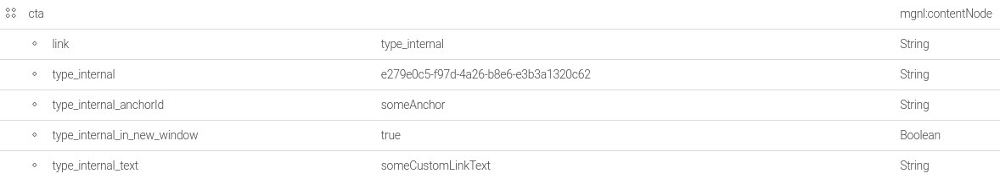
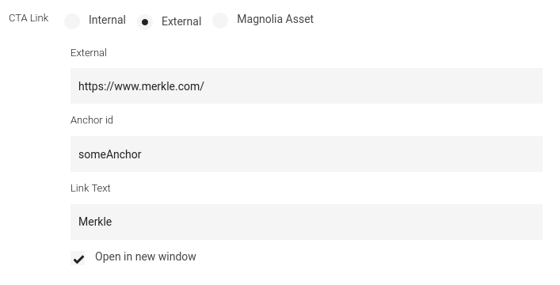
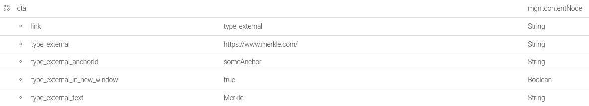
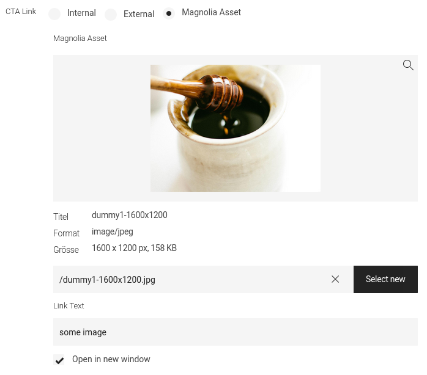
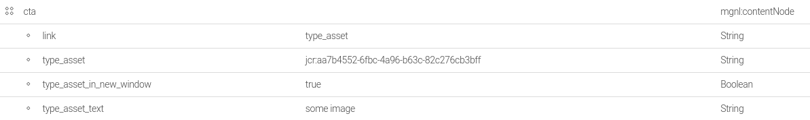

# LinkSet
A linkSet groups fields like e.g. link, link-text, ... for different link types, from which the author can choose from.<br>
It will create a child node with the name of the field and save its properties on it.<br>

## Usage
### Dialog
```java
import com.merkle.oss.magnolia.definition.custom.linkset.LinkTypes;
import info.magnolia.ui.field.EditorPropertyDefinition;
import info.magnolia.module.blossom.annotation.DialogFactory;
import info.magnolia.module.blossom.annotation.TabFactory;
import com.merkle.oss.magnolia.definition.custom.linkset.LinkSetDefinitionBuilder;

@TabFactory("someTab")
public List<EditorPropertyDefinition> someTab() {
	return List.of(
			new LinkSetDefinitionBuilder().build("cta"),
			new LinkSetDefinitionBuilder().linkOptions(LinkTypes.INTERNAL).build("ctaOnlyInternal"),
			new LinkDefinitionBuilder().build("ctaWithOnlyAnchor")
	);
}
```
### Model
```java
private final LinkModelFactory linkModelFactory;

@RequestMapping("someComponentRequestMapping")
public String render(final Model model, final PowerNode node) {
	linkModelFactory.create(locale, node, "cta");
	linkModelFactory.create(locale, dialogLocale, node, "cta"); //if cta is i18n (locale can differ from dialogLocale - e.g. link on english page to german home text(dialogLocale en): 'to german home' href (locale de): https://domain.com/de)
}
```

## Predefined link-types
### Internal
Link to an internal page.


<br>


### External
Link to an external website.


<br>


### Magnolia asset
Link to an internal DAM asset.


<br>


## SingleTree / SwitchableFieldI18n
1. Extend LinkSetDefinitionBuilder
   ```java
      import com.merkle.oss.magnolia.definition.custom.linkset.LinkSetDefinitionBuilder;
      
      public class CustomLinkSetDefinitionBuilder extends LinkSetDefinitionBuilder {
         public CustomLinkSetDefinitionBuilder() {
            super(true, false, false);
         }
      }
   ```
2. Extend InternalLinkFactory
   ```java
   import com.merkle.oss.magnolia.definition.custom.configuration.LinkUtil;
   import com.merkle.oss.magnolia.definition.custom.configuration.LocaleProvider;
   import com.merkle.oss.magnolia.definition.custom.linkset.LinkTypes;
   import com.merkle.oss.magnolia.definition.custom.linkset.model.InternalLinkFactory;
   import com.merkle.oss.magnolia.powernode.PowerNodeService;
   
   public class CustomInternalLinkFactory extends InternalLinkFactory {
      @Inject
      public LinkModelFactory(
              final PowerNodeService powerNodeService,
              final LinkUtil linkUtil,
              final LocaleProvider localeProvider
      ) {
         this(powerNodeService, linkUtil, localeProvider, true);
      }
   }
   ```
3. Bind factory
   ```xml
   <component>
      <type>com.merkle.oss.magnolia.definition.custom.linkset.model.InternalLinkFactory</type>
      <implementation>...CustomInternalLinkFactory</implementation>
   </component>
   ```

## SwitchableFieldI18n
1. Extend LinkSetDefinitionBuilder
   ```java
      import com.merkle.oss.magnolia.definition.custom.linkset.LinkSetDefinitionBuilder;
      
      public class CustomLinkSetDefinitionBuilder extends LinkSetDefinitionBuilder {
         public CustomLinkSetDefinitionBuilder() {
            super(false, false);
         }
      }
   ```
2. Extend LinkModelFactory
   ```java
   import com.merkle.oss.magnolia.definition.custom.linkset.LinkTypes;
   import com.merkle.oss.magnolia.definition.custom.linkset.model.LinkModelFactory;
   
   public class CustomLinkModelFactory extends LinkModelFactory {
      @Inject
      public LinkModelFactory(
              final LocaleProvider localeProvider,
              final ExtendedLinkAnchorModifier extendedLinkAnchorModifier,
              final Set<LinkType.Resolver> linkTypeResolvers,
              final Set<LinkFactory> linkFactories
      ) {
         this(localeProvider, extendedLinkAnchorModifier, linkTypeResolvers, linkFactories, false);
      }
   }
   ```
3. Bind factory
   ```xml
   <component>
      <type>com.merkle.oss.magnolia.definition.custom.linkset.model.LinkModelFactory</type>
      <implementation>...CustomLinkModelFactory</implementation>
   </component>
   ```

## Custom link-types
1. Define custom link types
    ```java
    import com.merkle.oss.magnolia.definition.custom.linkset.LinkType;
    
    import java.util.Arrays;
    import java.util.Objects;
    import java.util.Optional;
    
    public enum CustomLinkTypes implements LinkType {
        TAXONOMY("linkType.taxonomy.label", "type_taxonomy");
    
        private final String label;
        private final String value;
    
        CustomLinkTypes(final String label, final String value) {
            this.label = label;
            this.value = value;
        }
    
        @Override
        public String getLabel() {
            return label;
        }
    
        @Override
        public String getValue() {
            return value;
        }
    
        public static Optional<LinkType> fromValue(final String value) {
            return Arrays.stream(values())
                    .filter(type -> Objects.equals(type.getValue(), value))
                    .findFirst()
                    .map(linkType -> linkType);
        }
    }
    ```
2. Implement CustomLinkSetDefinitionBuilder
   ```java
   import com.merkle.oss.magnolia.definition.custom.linkset.BasicLinkSetDefinitionBuilder;
   import com.merkle.oss.magnolia.definition.custom.linkset.LinkSetDefinitionBuilder;
   import com.merkle.oss.magnolia.definition.custom.linkset.LinkType;
   import com.merkle.oss.magnolia.definition.custom.linkset.LinkTypes;
   import com.merkle.oss.magnolia.definition.custom.switchable.FieldOption;
   import ...TaxonomyLinkDefinitionBuilder;
   
   import java.util.Arrays;
   import java.util.stream.Collectors;
   import java.util.stream.Stream;
   
   public class CustomLinkSetDefinitionBuilder extends LinkSetDefinitionBuilder {
   
      public CustomLinkSetDefinitionBuilder() {
         //set default link-types to all
         linkOptions(Stream.concat(
                 Arrays.stream(LinkTypes.values()),
                 Arrays.stream(CustomLinkTypes.values())
         ).collect(Collectors.toList()));
      }
   
      @Override
      protected FieldOption<LinkType> createFieldOption(final LinkType linkType) {
         if(CustomLinkTypes.TAXONOMY.equals(linkType)) {
            return taxonomy();
         }
         return super.createFieldOption(linkType);
      }
   
      private FieldOption<LinkType> taxonomy() {
         return new FieldOption<>(
                 CustomLinkTypes.TAXONOMY,
                 name -> new BasicLinkSetDefinitionBuilder<>()
                         .openInNewWindow(openInNewTab(name))
                         .label("")
                         .build(name, new TaxonomyLinkDefinitionBuilder().build(name))
         );
      }
   }
   ```
3. Implement custom LinkFactory
   ```java
   import com.merkle.oss.magnolia.definition.custom.linkset.LinkSetDefinitionBuilder;
   import com.merkle.oss.magnolia.definition.custom.linkset.LinkType;
   import com.merkle.oss.magnolia.definition.custom.linkset.model.Link;
   import com.merkle.oss.magnolia.definition.custom.linkset.model.LinkModel;
   import com.merkle.oss.magnolia.definition.custom.linkset.model.LinkModelFactory;
   import com.merkle.oss.magnolia.powernode.PowerNode;
   import com.merkle.oss.magnolia.powernode.ValueConverter;
   import org.springframework.stereotype.Component;
   import ...TaxonomyService;
   
   import javax.inject.Inject;
   import java.util.Locale;
   import java.util.Optional;
   
   public class TaxonomyLinkModelFactory implements LinkModelFactory.LinkFactory {
       private final TaxonomyService taxonomyService;
   
       @Inject
       public TaxonomyLinkModelFactory(final TaxonomyService taxonomyService) {
           this.taxonomyService = taxonomyService;
       }
   
       @Override
       public Optional<Link> create(final Locale locale, final Locale dialogLocale, final PowerNode node, final String propertyName) {
           return node.getProperty(propertyName, dialogLocale, ValueConverter::getString)
                   .flatMap(identifier ->
                           taxonomyService.getTaxonomy(identifier, locale)
                   )
                   .map(taxonomy ->
                           new LinkModel(
                                   taxonomy.getDisplayName(),
                                   "/" + locale.toLanguageTag() + "/tags/" + taxonomy.getSlug(),
                                   "https://someDomain.com/" + locale.toLanguageTag() + "/tags/" + taxonomy.getSlug(),
                                   node.getProperty(LinkSetDefinitionBuilder.OPEN_IN_NEW_TAB_PROPERTY_NAME_PROVIDER.apply(propertyName), ValueConverter::getBoolean).orElse(false),
                                   false,
                                   CustomLinkTypes.TAXONOMY
                           )
                   );
       }
   
       @Override
       public boolean test(final LinkType linkType) {
           return CustomLinkTypes.TAXONOMY.equals(linkType);
       }
   }
   ```
4. Bind custom link type resolver/factory
   ```java
   import com.google.inject.multibindings.Multibinder;
   import com.merkle.oss.magnolia.definition.custom.linkset.LinkType;
   import com.merkle.oss.magnolia.definition.custom.linkset.model.LinkModelFactory;   
   import info.magnolia.objectfactory.guice.AbstractGuiceComponentConfigurer;
   
   public class CustomLinkTypesGuiceComponentConfigurer extends AbstractGuiceComponentConfigurer {
      @Override
      protected void configure() {
         super.configure();
         final Multibinder<LinkType.Resolver> linkTypeResolversMultibinder = Multibinder.newSetBinder(binder, LinkType.Resolver.class);
         linkTypeResolversMultibinder.addBinding().toProvider(() -> CustomLinkTypes::fromValue);
   
           final Multibinder<LinkModelFactory.LinkFactory> linkFactoriesMultibinder = Multibinder.newSetBinder(binder, LinkModelFactory.LinkFactory.class);
        linkFactoriesMultibinder.addBinding().to(TaxonomyLinkModelFactory.class);
      }
   }
   ```
