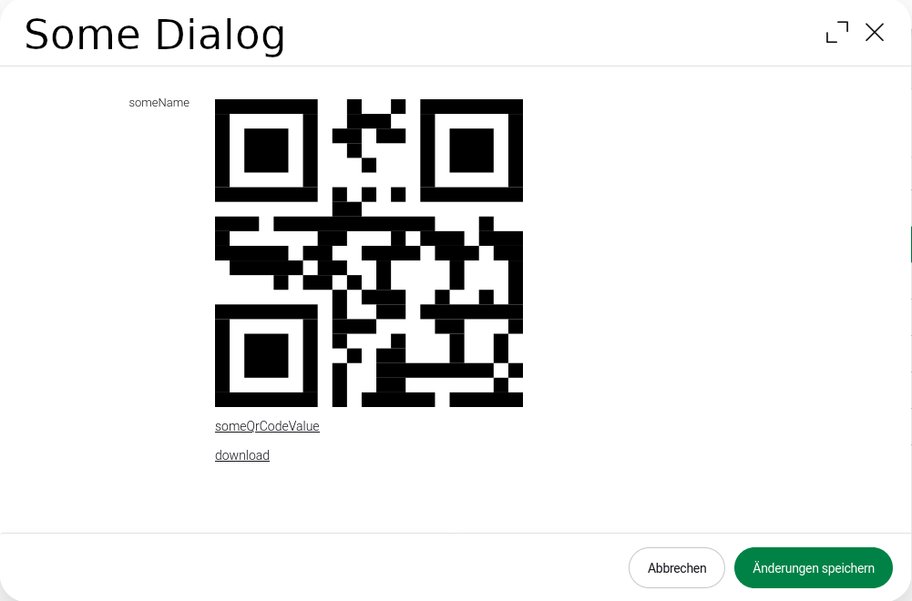

# QR-Code
A read only QR-Code field.

## Screenshots
### Dialog


## Usage
### Dialog

```java
import info.magnolia.ui.field.EditorPropertyDefinition;
import info.magnolia.module.blossom.annotation.TabFactory;

import com.merkle.oss.magnolia.definition.builder.simple.TextFieldDefinitionBuilder;
import com.merkle.oss.magnolia.definition.custom.colorpicker.ColorPickerFieldDefinitionBuilder;
import com.merkle.oss.magnolia.definition.custom.qrcode.QrCodeFieldDefinition;
import com.merkle.oss.magnolia.definition.custom.qrcode.QrCodeFieldDefinition.CaptionRenderType;
import com.merkle.oss.magnolia.definition.custom.qrcode.QrCodeFieldDefinitionBuilder;

@TabFactory("someTab")
public List<EditorPropertyDefinition> someTab() {
    return List.of(
            new TextFieldDefinitionBuilder().build("someQrCode"),
            new QrCodeFieldDefinitionBuilder()
                    .captionRenderType(CaptionRenderType.LINK)
                    .downloadLink(builder -> Optional.of(builder.build("download")))
                    .build("someName", "someQrCode")
    );
}
```
