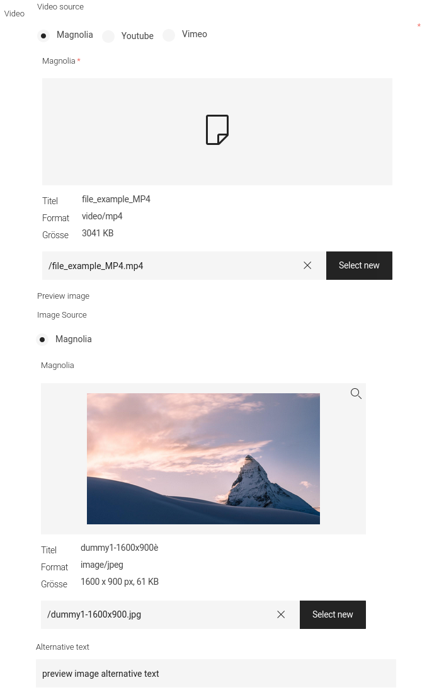
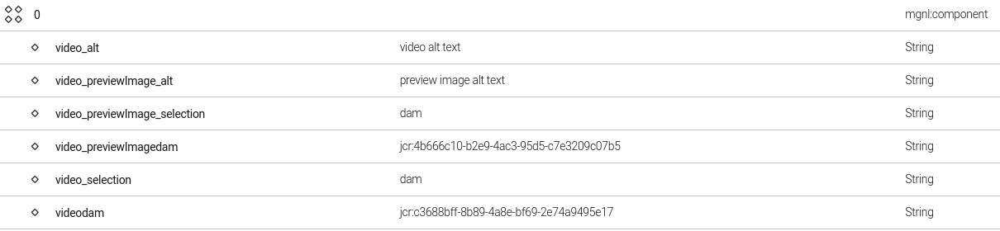
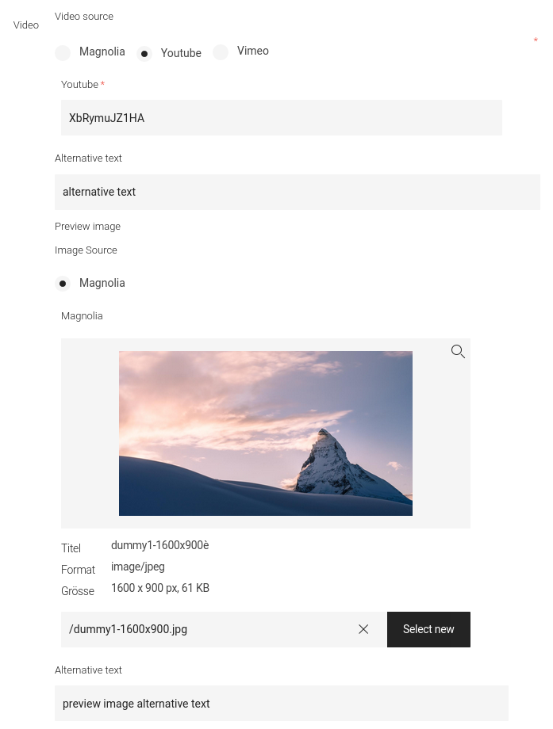
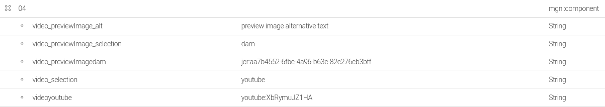
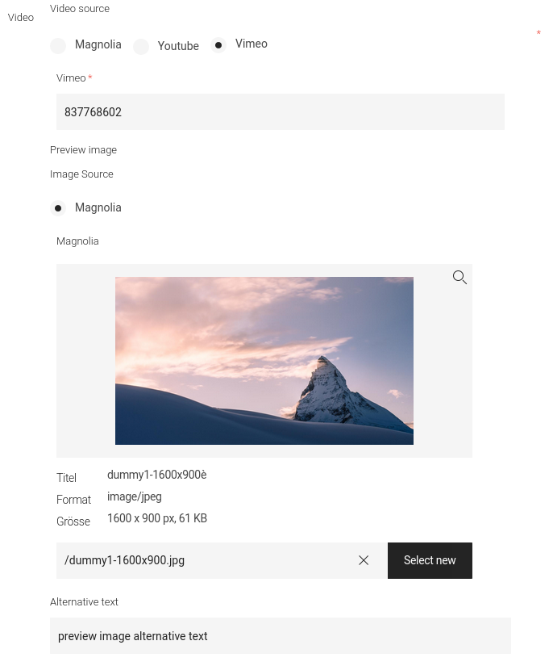
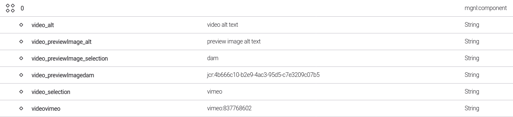

# VideoSet
A videoSet groups the fields video-source and previewImage [imageSet](../imageset/README.md) for different video types, from which the author can choose from.

## Usage
### Dialog

```java
import com.merkle.oss.magnolia.definition.custom.videoset.VideoSetDefinitionBuilder;
import com.merkle.oss.magnolia.definition.custom.videoset.VideoTypes;
import info.magnolia.ui.field.EditorPropertyDefinition;
import info.magnolia.module.blossom.annotation.TabFactory;

@TabFactory("someTab")
public List<EditorPropertyDefinition> someTab() {
   return List.of(
           new VideoSetDefinitionBuilder().build("video"),
           new VideoSetDefinitionBuilder().videoOptions(VideoTypes.DAM).build("videoOnlyMagnoliaAssets")
   );
}
```
### Model

```java
import com.merkle.oss.magnolia.definition.custom.videoset.model.VideoModel;
import com.merkle.oss.magnolia.definition.custom.videoset.model.VideoReferenceModel;

private final VideoReferenceModel.Factory videoReferenceFactory;
private final VideoModel.Factory videoFactory;

@RequestMapping("someComponentRequestMapping")
public String render(final Model model, final PowerNode node) {
   videoReferenceFactory.create("video", node);
   videoReferenceFactory.create("video", dialogLocale, node); // if video is i18n
   videoFactory.create(locale, "video", node);
   videoFactory.create(locale, dialogLocale, "video", node); // if video is i18n (locale can differ from dialogLocale)
}
```

## Predefined video-types
### DAM
Internal magnolia DAM asset.


<br>


### Youtube
Youtube video, specified by ID.


<br>


### Vimeo
Vimeo video, specified by ID.


<br>


## videoFieldI18n
1. Extend VideoSetDefinitionBuilder
   ```java
   import com.merkle.oss.magnolia.definition.custom.videoset.VideoSetDefinitionBuilder;
   
   public class CustomVideoSetDefinitionBuilder extends VideoSetDefinitionBuilder {
      public CustomVideoSetDefinitionBuilder() {
         super(false, false);
      }
   }
   ```
2. Extend VideoReferenceModel.Factory
   ```java
   import java.util.Set;
   import jakarta.inject.Inject;
   import com.merkle.oss.magnolia.definition.custom.configuration.LocaleProvider;
   import com.merkle.oss.magnolia.definition.custom.videoset.VideoType;
   import com.merkle.oss.magnolia.definition.custom.videoset.model.VideoReferenceModel;
   
   public class CustomVideoReferenceModelFactory extends VideoReferenceModel.Factory {
      @Inject
      public CustomVideoReferenceModelFactory(
             final LocaleProvider localeProvider,
             final Set<VideoType.Resolver> videoTypeResolvers,
             final ImageReferenceModel.Factory imageReferenceFactory
      ) {
         super(localeProvider, videoTypeResolvers, imageReferenceFactory, false);
      }
   }
   ```
3. Extend VideoModel.Factory
   ```java
   import java.util.Set;
   import jakarta.inject.Inject;
   import com.merkle.oss.magnolia.definition.custom.configuration.LocaleProvider;
   import com.merkle.oss.magnolia.definition.custom.videoset.model.VideoModel;
   
   public class CustomVideoModelFactory extends VideoModel.Factory  {
       @Inject
       public CustomImageModelFactory(
               final LocaleProvider localeProvider,
			   final CustomImageReferenceModelFactory videoReferenceFactory,
			   final Set<VideoSourceTransformer> videoSourceTransformers
       ) {
           super(localeProvider, videoReferenceFactory, videoSourceTransformers);
       }
   }
   ```
4. Bind both factories
   ```xml
   <component>
      <type>com.merkle.oss.magnolia.definition.custom.videoset.model.VideoModel$Factory</type>
      <implementation>...CustomVideoModelFactory</implementation>
   </component>
   <component>
      <type>com.merkle.oss.magnolia.definition.custom.videoset.model.VideoReferenceModel$Factory</type>
      <implementation>...CustomVideoReferenceModelFactory</implementation>
   </component>
   ```

## Custom video-types
1. Define custom video types
    ```java
   import com.merkle.oss.magnolia.definition.custom.videoset.VideoType;
   
   import java.util.Arrays;
   import java.util.Objects;
   import java.util.Optional;
   
   public enum CustomVideoTypes implements VideoType {
       APRIMO("videoType.aprimo.label", "aprimo");
   
       private final String label;
       private final String value;
   
       CustomVideoTypes(final String label, final String value) {
           this.label = label;
           this.value = value;
       }
   
       @Override
       public String getLabel() {
           return label;
       }
   
       @Override
       public String getValue() {
           return value;
       }
   
       public static Optional<VideoType> fromValue(final String value) {
           return Arrays.stream(values())
                   .filter(type -> Objects.equals(type.getValue(), value))
                   .findFirst()
                   .map(videoType -> videoType);
       }
   }
    ```
2. Implement CustomVideoSetDefinitionBuilder
   ```java
   import com.merkle.oss.magnolia.definition.builder.simple.TextFieldDefinitionBuilder;
   import com.merkle.oss.magnolia.definition.custom.videoset.VideoSetDefinitionBuilder;
   import com.merkle.oss.magnolia.definition.custom.videoset.VideoType;
   import com.merkle.oss.magnolia.definition.custom.videoset.VideoTypes;
   import com.merkle.oss.magnolia.definition.custom.switchable.FieldOption;
   import com.merkle.oss.magnolia.definition.custom.switchable.SingleSwitchableForm;
   
   import java.util.Arrays;
   import java.util.stream.Collectors;
   import java.util.stream.Stream;
   
   public class CustomVideoSetDefinitionBuilder extends VideoSetDefinitionBuilder {
   
      public CustomVideoSetDefinitionBuilder() {
         //set default video-types to all
         videoOptions(Stream.concat(
                 Arrays.stream(VideoTypes.values()),
                 Arrays.stream(CustomVideoTypes.values())
         ).collect(Collectors.toList()));
      }
   
      @Override
      protected FieldOption<VideoType> createFieldOption(final VideoType videoType) {
         if(CustomVideoTypes.APRIMO.equals(videoType)) {
            return aprimo();
         }
         return super.createFieldOption(videoType);
      }
   
      private FieldOption<VideoType> aprimo() {
         return new FieldOption<>(
                 CustomVideoTypes.APRIMO,
                 n -> new SingleSwitchableForm<>(
                         new TextFieldDefinitionBuilder()
                                 .label(LABEL_PREFIX + CustomVideoTypes.APRIMO.getLabel())
                                 .converterClass(AprimoTextValueConverter.class)
                                 .description("enter aprimo ID")
                                 .build(n)
                 )
         );
      }
   }
   ```
3. Implement custom VideoSourceTransformer
   ```java
   import com.merkle.oss.magnolia.definition.custom.videoset.VideoType;
   import com.merkle.oss.magnolia.definition.custom.videoset.model.VideoModel;
   
   import java.util.Locale;
   import java.util.Optional;
   
   public class AprimoVideoSourceTransformer implements VideoModel.VideoSourceTransformer {
   
      @Override
      public Optional<VideoModel.VideoSource> transform(final Locale locale, final String assetId) {
         return Optional.of(new VideoModel.VideoSource(
                 "https://aprimo.com/asset/"+assetId
         ));
      }
   
      @Override
      public boolean test(final VideoType videoType) {
         return CustomVideoTypes.APRIMO.equals(videoType);
      }
   }
   ```
4. Bind custom video type resolver/transformer
   ```java
   import com.google.inject.multibindings.Multibinder;
   import com.merkle.oss.magnolia.definition.custom.videoset.VideoType;
   import com.merkle.oss.magnolia.definition.custom.videoset.model.VideoModel;   
   import info.magnolia.objectfactory.guice.AbstractGuiceComponentConfigurer;
   
   public class CustomVideoTypesGuiceComponentConfigurer extends AbstractGuiceComponentConfigurer {
      @Override
      protected void configure() {
         super.configure();
         final Multibinder<VideoType.Resolver> videoTypeResolversMultibinder = Multibinder.newSetBinder(binder, VideoType.Resolver.class);
         videoTypeResolversMultibinder.addBinding().toProvider(() -> CustomVideoTypes::fromValue);
   
         final Multibinder<VideoModel.VideoSourceTransformer> videoSourceTransformersMultibinder = Multibinder.newSetBinder(binder, VideoModel.VideoSourceTransformer.class);
         videoSourceTransformersMultibinder.addBinding().to(AprimoVideoSourceTransformer.class);
      }
   }
   ```
